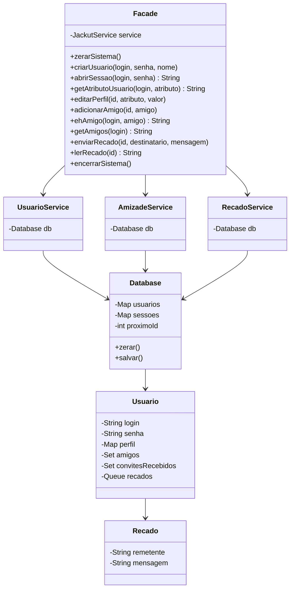

# Relatorio - Milestone 1 do Jackut

## Objetivo

Este projeto implementa a logica de negocio inicial da rede de
relacionamentos Jackut em Java, cobrindo as User Stories 1 a 4:

1. Criacao de conta.
2. Criacao e edicao de perfil.
3. Adicao de amigos por convite bilateral.
4. Envio e leitura de recados.

Nao ha interface grafica. O acesso externo ocorre pela classe `Facade`, que
oferece os metodos descritos no enunciado para integracao com os scripts do
EasyAccept.

## Principios de OOP usados

- Encapsulamento: `Usuario` protege seus dados internos e expoe operacoes de
  dominio, como editar perfil, receber convite e ler recado.
- Responsabilidade unica: `SessionManager` controla sessoes, `JackutRepository`
  cuida de persistencia e `JackutService` coordena as regras de negocio.
- Baixo acoplamento: a fachada delega para o servico e nao conhece detalhes de
  armazenamento ou das colecoes internas das entidades.
- Alta coesao: cada classe concentra metodos relacionados aos seus proprios
  dados e responsabilidades.

## Escolhas de design

`Facade` fica no pacote `Jackut`, seguindo a mesma organizacao usada no projeto
`ifood_thing`: a pasta principal do pacote fica na raiz do projeto e as
subpastas separam `models`, `services` e `exceptions`. A fachada nao contem
regra de negocio; ela apenas repassa chamadas para os servicos.

`Usuario` armazena o perfil em um `Map<String, String>`, permitindo que novos
atributos sejam criados sem mudancas na classe. As amizades confirmadas ficam
em um `Set<String>` para evitar duplicidade. Convites pendentes sao modelados
como logins de usuarios que ja solicitaram amizade; quando o usuario convidado
tambem adiciona o solicitante, a amizade passa a existir para ambos.

Recados sao guardados em uma fila (`Queue<Recado>`), pois o requisito pede a
leitura do primeiro recado disponivel. Assim, a leitura segue a ordem de envio.

`Database` segue o papel do banco em memoria usado no projeto de referencia.
Ele centraliza usuarios, sessoes e persistencia por serializacao Java em
`jackut.dat`, arquivo relativo ao diretorio de execucao.

## Diagrama de classes

## Possiveis extensoes

As historias futuras podem ser acrescentadas sem alterar a fachada atual:
comunidades podem ser novas entidades de dominio, enquanto novos
relacionamentos podem ser representados por classes ou estrategias especificas
para cada regra.
